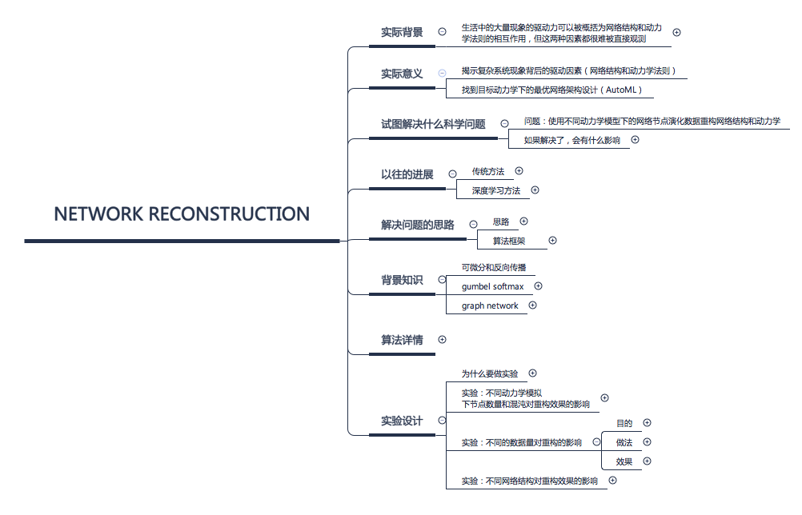

# BNUSSS Toolkit

*这里是BNUSSS工具箱，这个工具箱存在的意义是为我们更好的实践科研范式提供一套工具。*

## 梳理科研项目的思维链条：Xmind8

在我们做科研项目的时候，一个非常重要的点是（至少第一作者）必须要对自己的科研项目的整个思维链条非常熟悉。这包括，至少可以流畅的回答以下问题：

- 我的工作的实际背景是什么
- 实际意义是什么（小综述）
- 以往，前辈们在这个问题上有哪些进展
- 我的工作具体解决的科学问题是什么
- 解决问题的思路是什么
- 支撑我的工作，需要哪些背景知识
- 算法框架是什么
- 算法的各个模块是怎样工作的
- 未来有哪些方向

针对科研的实验设计，也应该清晰的了解

- 实验的对比模型是什么，为什么选择这个对比模型
- 应该设计哪些实验，目的是什么
- 实验的执行方法是什么
- 实验的结论是什么
- 实验结果反映了我的方法有怎样的特点，有怎样的不足

可以看到，要回答上述问题，需要对大量的想法、数据和结论进行整理，因此我们有必要选取一个记录整个逻辑思维链条各个环节的工具。xmind8 [https://www.xmind.cn/xmind8-pro/]（https://www.xmind.cn/xmind8-pro/） 是一个免费的思维导图软件，既可以用于记录新的想法、进展，也便于整理老的想法，从宏观的角度审视自己的工作。

例如（一个未展开的导图）：

## 实验协作流程管理：石墨文档

正如张老师所说，要发好的期刊，工作量都是非常大的，因此记录我们工作的阶段性结论就很重要。 
石墨文档是一个在线多人协作文档（https://shimo.im） 
针对实验流程的管理，尤其是涉及到多人协作的时候，我们可以整理如下表格 
每天大家可以把今日工作结果用两句话整理到石墨文档上（只记录重要结论，无需记录细节），也可以开会后定某件事情的DDL写在文档上。 

例如（一个示例管理表格）：

## 代码管理工具：Gitlab

（感谢集智学园程序组友情协助）
