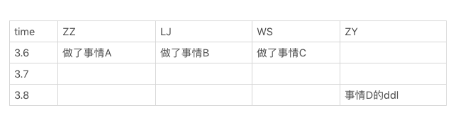
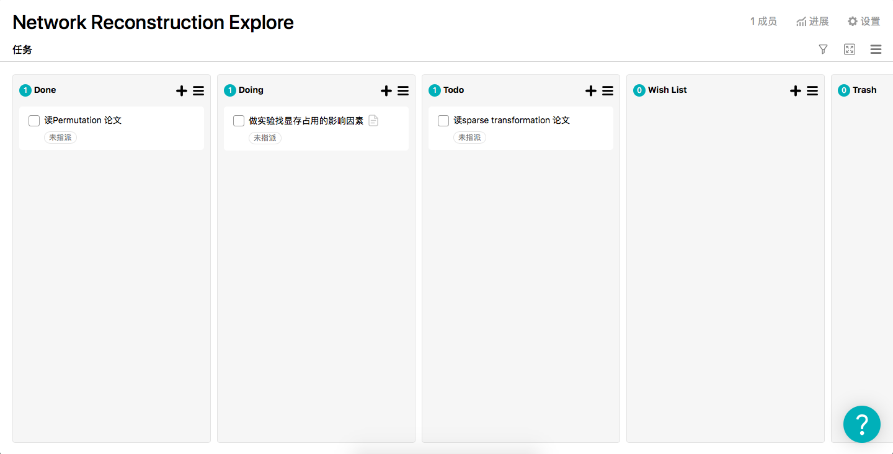

# BNUSSS Toolkit

*这里是BNUSSS工具箱，这个工具箱存在的意义是为我们更好的实践科研范式提供一套工具。*

## 梳理科研项目的思维链条：Xmind8

在我们做科研项目的时候，一个非常重要的点是（至少第一作者）必须要对自己的科研项目的整个思维链条非常熟悉。这包括，至少可以流畅的回答以下问题：

- 我的工作的实际背景是什么
- 实际意义是什么（小综述）
- 以往，前辈们在这个问题上有哪些进展
- 我的工作具体解决的科学问题是什么
- 解决问题的思路是什么
- 支撑我的工作，需要哪些背景知识
- 算法框架是什么
- 算法的各个模块是怎样工作的
- 未来有哪些方向

针对科研的实验设计，也应该清晰的了解

- 实验的对比模型是什么，为什么选择这个对比模型
- 应该设计哪些实验，目的是什么
- 实验的执行方法是什么
- 实验的结论是什么
- 实验结果反映了我的方法有怎样的特点，有怎样的不足

可以看到，要回答上述问题，需要对大量的想法、数据和结论进行整理，因此我们有必要选取一个记录整个逻辑思维链条各个环节的工具。xmind8 https://www.xmind.cn/xmind8-pro/ 是一个免费的思维导图软件，既可以用于记录新的想法、进展，也便于整理老的想法，从宏观的角度审视自己的工作。

例如（一个未展开的导图）：

详细展开版(内部同学可见)请见：

## 实验协作流程管理：石墨文档

要发好的期刊，工作量都是非常大的，因此记录我们工作的阶段性结论就很重要。 
石墨文档是一个在线多人协作文档（https://shimo.im） 
针对实验流程的管理，尤其是涉及到多人协作的时候，我们可以整理如下表格 
每天大家可以把今日工作结果用两句话整理到石墨文档上（只记录重要结论，无需记录细节），也可以开会后定某件事情的DDL写在文档上。 

例如（一个示例管理表格）：

## 代码管理工具：Gitlab / github

感谢集智学园程序组友情协助 
git的使用已经成为了一项基本技能，相信大家都有必要学会熟练的使用git  
科研项目的代码量并不多，协作要求不高，但每个版本都十分重要，因此我们可以着重使用gitlab的

- 代码版本打tag功能
- code review功能
- 快速同步功能

## 建立你的个人网站：mobirise.co / html5up.net

建立你的个人网站可以方便的向他人展示你自己 
Git Pages(https://pages.github.com) 是一个方便、免费、广受认可的静态网站托管平台，可以为我们所使用 
 

以下是两个简单的例子 

https://lingfeiwu.github.io/  
https://3riccc.github.io/  

以下是一些方便且美观的建站工具 
https://mobirise.co   
https://html5up.net

## 看板项目管理工具：tower / trollow

看板式项目管理是一种清晰，简洁的项目管理方式  
具体而言，我们可以将任务分为 wish list / to do / doing / done / trash 这五类  
因为一个科研项目往往需要关注很多因素， 看板式的项目管理可以帮助我们梳理那些事情正处于哪些状态  
一个健康的任务会从todo 跑到 doing 再跑到 done  
当然，如果我们发现这个任务没有必要，可以把它扔到trash里面  
一些奇奇怪怪的想法也可以记录到 wish list里面  
一个典型的看板项目如下：

tower（https://tower.im）和 trollow （https://trello.com） 是两个免费的支持看板任务管理的web软件，值得一试

 

如果你还有其他好用的工具，欢迎联系3riccczz@gmail.com（张章）
 
Tools may help, but don't be trapped.
